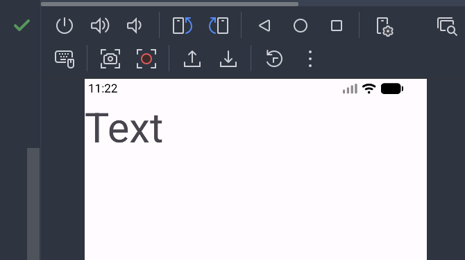
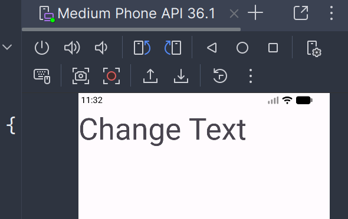
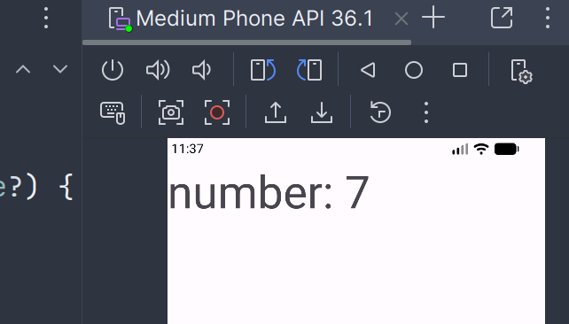

# Kotlin 入门
## xml
xml 格式，半结构化的文本文件。  

## Kotlin 介绍
基于 JVM 的静态类型编程语言  
可以编译成 Java 字节码，也可以编译成 JavaScript。  
运行在 Java 虚拟机上的静态类型编程语言。可复用现有的 Java 类库。  
kotlin 精简了代码。  

## kotlin 基础语法
### 变量和函数
只允许在变量前声明两种关键字：`val` 和 `var`  
- `val` 声明一个不可变的变量, 在初始赋值之后就不能再重新赋值，对应 java 中的 final 变量  
- `var` 声明一个可变的变量,在初始赋值后还可以再重新赋值。  

``` kotlin
val a = 10
var b = 5
```

全部使用了对象数据类型。  
在 java 中 int 是整形关键字，而 kotlin 是一个类。  

`fun` 是定义函数的关键字。  
``` kotlin
fun fn(parm1: Int, parm2: Int):Int{
    return 0
}
```
紧接在 fun 后面的是函数名。  
函数名后面的一对括号中，可以声明该函数接收什么参数。  
括号后面的部分可选，用于声明该函数会返回声明类型的数据，如果不需要返回任何数据，这部分可以不写。  

两个大括号之间的内容是结构体，编写函数的具体逻辑。  

```
fun methodNmae(parm1:Int, parm2:Int) = 0
```
可以直接将唯一的一行代码写在函数定义的尾部。  

## 逻辑控制
if 可以有返回值。  
返回值就是 if 语句每一个条件最后一行代码的返回值。  

when 条件语句。  
当需要判断的条件非常多的时候，可以考虑使用 when 语句来替代 if 语句。  
```kotlin
when()
{
""->10
""->11
}
```

for-in 循环语句  
```kotlin
val range = 0..10 // [0, 10]
val range = 0 until 10 // [0, 10)
```

## 面向对象语言
类和对象  
可以使用如下代码定义一个类，以及声明它拥有的字段和函数。  
``` kotlin
class Person{
    var ame = ""
    var age = 0
    fun eat(){
        ...
    }
}
```

kotlin 类默认是不可以继承的，如果要能够被继承，需要主动声明 open 关键字。  

接口，interface  
override  

## lambda 编程
一小段可以作为参数传递的代码。  
```

```

## 空指针检查
空指针是不受编程语言检查的运行时异常。  
判空辅助工具:`?:`  

字符串内嵌表达式。  

## 在屏幕上打印一段文字
入门一个框架，最开始肯定是尝试进行打印了。  
制作一个能显示自己所愿的文字的程序。  
到 `/app/src/main/res/layout` 下找到 `activity_main.xml`，这是一个布局文件。  
在里面新建一个 `<TextView>`字体显示控件:  
``` xml
<TextView
    android:id="@+id/text_show"
    android:layout_width="wrap_content"
    android:layout_height="wrap_content"
    android:textSize="130px"
    android:text="Text"
    />
```


应该是很好理解的：  
`::id` 设置控件的 id  
`::layout_width` 和 `::layout_height` 的属性都是 `wrap_content` 使得该 textview 视图的宽高会根据内容自适应。  
后面都还好理解。  


这样编译后就可以在左上角显示文本 Text 了。 

在布局文件写好后就是写下 kotlin 代码，主代码在 `MainActivity.kt`内。  
程序会在 `onCreate` 方法运行,

编写的逻辑放在 onCreate 内就可以。首先创建一个 findViewById：
``` kotlin
val textshow = findViewById<TextView>(R.id.text_show)
```
修改 text 变量即可改变显示的字：  
``` kotlin
textshow.text = "Change Text"
```



稍作修改，引入一个 Delay 函数就可以实现计数了：  



主要代码：
``` kotlin
for (i in 1..100) {
    android.os.Handler(Looper.getMainLooper()).postDelayed({
        textshow.text = "number: " + i
    }, i * 1000L)
```
具体的 Hander 和 postDelayed 我不是很深入理解，不过这样确确实实可以实现 1 秒间隔更新文字，只是断点难以体现。  
